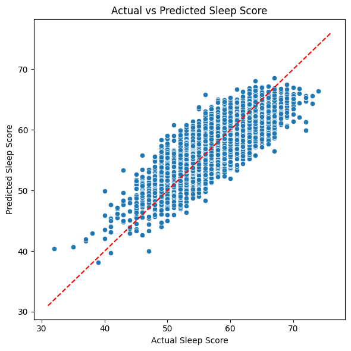
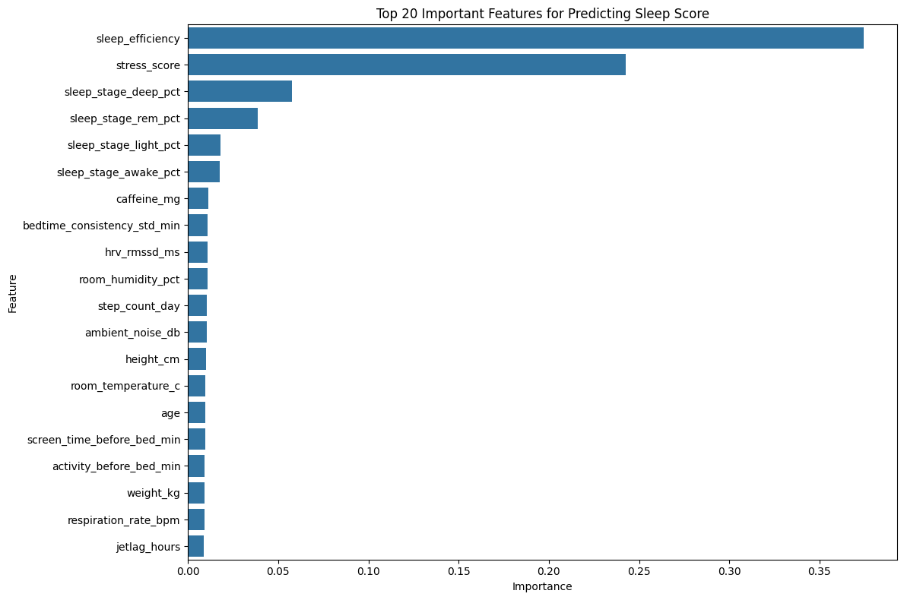
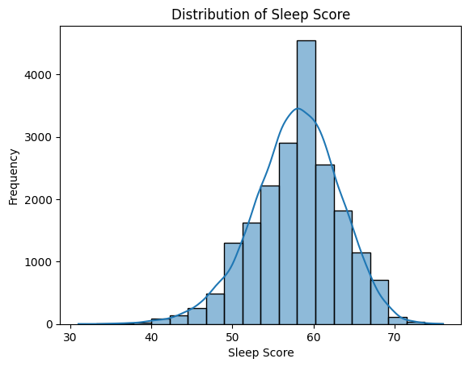
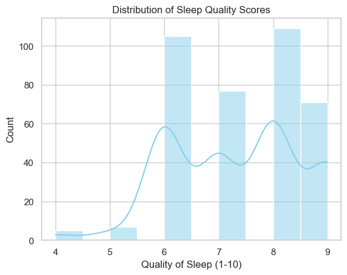

# Sleep Quality Prediction App

Predict sleep quality using smartwatch data. This full-stack application provides personalized insights using a machine learning model trained on health and behavioral data. It features a React frontend and FastAPI backend.

---

## Project Overview

* Frontend: React with Material UI
* Backend: FastAPI (Python)
* Machine Learning: Random Forest model
* Data Source: Custom dataset combining smartwatch metrics and survey responses
* Deployment Mode: Local (localhost)

---

## Features

* Predicts sleep quality from smartwatch-style inputs
* Minimal user input required
* SHAP-based feature explanation
* Lifestyle suggestions to improve sleep
* Responsive UI built with Material UI
* API-based backend built with FastAPI

---
## Model Information

* `A Random Forest Regressor` was trained using a dataset containing both survey responses and smartwatch metrics.
* While **survey data** was used for training and experimentation, the final deployed model is based solely on **smartwatch data** to improve user usability.
* SHAP is used to generate per-prediction explanations.
* Features considered include:
  - **Age**, **Gender**
  - **Sleep Stages (%)**, **Stress Score**
  - **Steps Per Day**, **Screen Time Before Bed**
  - **Sleep Efficiency**, **Deep Sleep (%)**, **Light Sleep (%)**

---
<p align="center">
  
  
</p>
<p align="center">
  
  
</p>


---


## Installation

### 1. Clone the repository

```bash
git clone https://github.com/yourusername/sleep-quality-predictor.git
cd sleep-quality-predictor
```

### 2. Backend Setup

```bash
cd backend
python -m venv venv
source venv/bin/activate      # Windows: venv\Scripts\activate
pip install -r requirements.txt
uvicorn main:app --reload
```

The FastAPI backend will run at:
`http://127.0.0.1:8000`

### 3. Frontend Setup

```bash
cd frontend
npm install
npm start
```

The React frontend will run at:
`http://localhost:3001`

---

## Usage

1. Open the frontend in your browser
2. Enter smartwatch-style data (like age, stress level, screen time, steps, etc.)
3. Click **Predict** to view:

   * Predicted sleep quality
   * Lifestyle suggestions
   * Visual explanation of contributing factors

---


